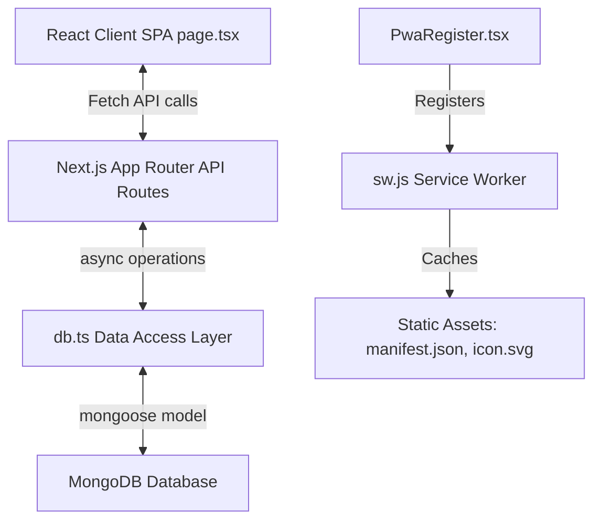

# AlphaTrader Journal - Walkthrough

AlphaTrader is a premium, fullstack, offline-ready Progressive Web Application (PWA) built with **Next.js**, **TypeScript**, and **Vanilla CSS**. It is designed for traders to log their positions, manage risk, analyze execution strategies, and monitor their psychological discipline.

---

## 🚀 Key Features

- **PWA Capabilities**: Fully installable on iOS, Android, and Desktop, featuring a configured web manifest (`manifest.json`) and a robust service worker (`sw.js`) for offline caching of core app elements.
- **Visual Performance Curve**: A custom-drawn, glowing vector line chart representing cumulative equity growth. Interactive tooltips display date-by-date balances.
- **Risk Calculator**: Prefilled contract sizing based on asset class (Forex, Crypto, Stocks, Futures) with real-time risk amount ($) and risk percentage (%) calculators.
- **Psychology Analysis**: Bar charts illustrating the exact financial impact (P&L) of emotions (Calm, Confident, Anxious) and discipline tags (FOMO, Revenge Trading, Patience).
- **Data Portability**: Full backup system allowing users to export their database as a JSON file, import backups, wipe records, or reset to sample trades.

---

## 📁 Project Structure

```
tradingjournalapp/
├── public/
│   ├── icon.svg             # SVG logo with glowing neon candlesticks
│   ├── manifest.json        # Web app manifest for PWA installation
│   └── sw.js                # Service Worker for offline asset caching
├── src/
│   ├── app/
│   │   ├── api/
│   │   │   ├── db/
│   │   │   │   └── route.ts # Database administration (reset, clear, import)
│   │   │   └── trades/
│   │   │       ├── [id]/
│   │   │       │   └── route.ts # UPDATE (PUT) and DELETE trade endpoints
│   │   │       └── route.ts     # LIST (GET) and CREATE (POST) trade endpoints
│   │   ├── globals.css      # Vanilla CSS theme, design tokens, and components
│   │   ├── layout.tsx       # Root layout setting viewport, theme colors, and SW registration
│   │   └── page.tsx         # SPA View shell, state manager, and API integration
│   ├── components/
│   │   ├── DashboardView.tsx # Key metrics, Recent Trades, and Equity curve
│   │   ├── TradesView.tsx    # Search directory with direction/status pills
│   │   ├── AnalyticsView.tsx # Expectancy ratios, Strategy performance & Psychology chart
│   │   ├── ProfileView.tsx   # Balance configuration, Backup import/export & SW installer
│   │   ├── TradeModal.tsx    # 4-tab wizard form (Basic Info, Results, Psychology, Charts)
│   │   ├── TradeDetailModal.tsx # Full detailed drawer for individual trade retro
│   │   ├── PwaRegister.tsx   # Service worker registration client component
│   │   └── Icons.tsx         # Custom, lightweight, dependency-free SVG icon assets
│   ├── models/
│   │   └── Trade.ts         # Mongoose schema model for trades
│   └── lib/
│       ├── mongodb.ts       # MongoDB connection caching utility
│       └── db.ts            # Data access layer helper (MongoDB API)
├── .env.local               # Environment variables configuration
```

---

## 🛠️ Architecture & Data Flow



---

## 🎨 Design System (`globals.css`)

The application's aesthetics are custom-tailored using pure **Vanilla CSS** rather than utility frameworks to ensure extreme layout control and low bundle size. Key design tokens include:

- **Background Palette**: `#080d16` (deep space background) with cards utilizing glassmorphic panels (`rgba(17, 26, 46, 0.8)`) and fine `rgba(255, 255, 255, 0.07)` borders.
- **Accents**: Glow shadows (`--shadow-glow`) mimicking financial terminals.
- **Trading Colors**: High-impact bullish emerald green (`#10b981`) and bearish red-coral (`#f43f5e`).
- **Pills**: Selector badges for emotions and psychology tags that adapt based on whether they are disciplined (green) or undisciplined (red).

---

## 📈 Running the Application

The development server is currently running in the background. You can access it locally at:
👉 **[http://localhost:3001](http://localhost:3001)**

### Commands
- Run development server: `npm run dev`
- Build for production: `npm run build`
- Start production server: `npm run start`
